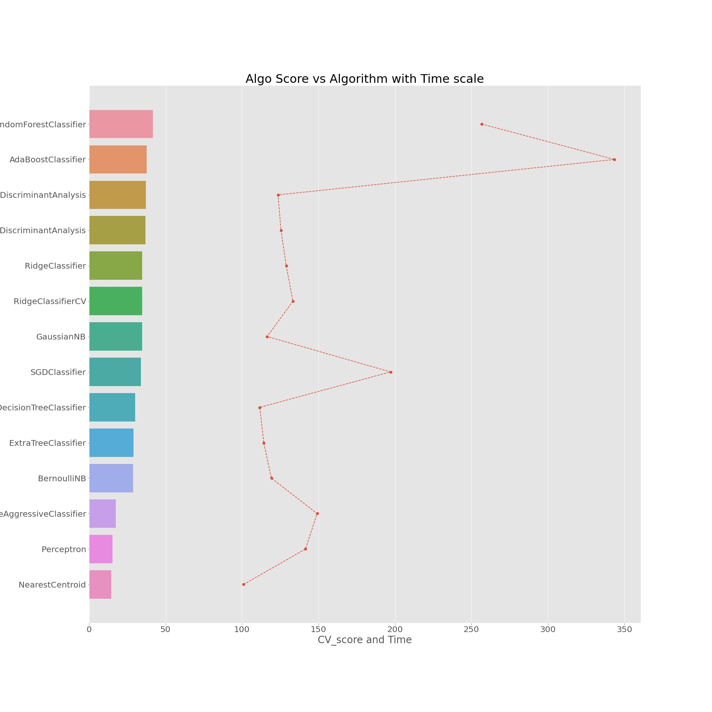

# Assignment 1
##### To Model a classifier for predicting condition of beds on hospital using following hospital data.
* Download Link : https://drive.google.com/file/d/1LV--pkbKFH5Ys-KHBt6Uoiw8458NxGjo/view?usp=sharing

## Approach to Problem

1. Data Prepration by handling Missing Values, Checking for Categorical Values in Dataset and Spliting Dataset into Training and Testing
2. Data Visualisations
3. Model Selection (Implemented Models - DecisionTreeClassifier, SGDClassifier, RandomForestClassifier, AdaBoostClassifier, Light Gradient Boosting Machine and many more) and Comparing them by there Accuracy and Run time

### Model Performance over Test Dataset
